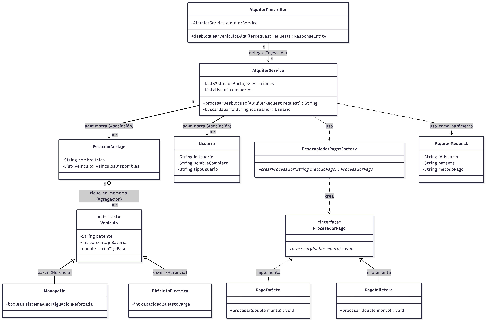

Examen Parcial Programación III
Alumno: Bruno Sandoval Sebastian
Este repositorio contiene la implementación del sistema central de "EcoRide", una plataforma para gestionar el desbloqueo y cobro de vehículos eléctricos (Monopatines y Bicicletas Eléctricas), desarrollado como examen práctico.

## 🛠️ Tecnologías Utilizadas
* **Java 21**
* **Spring Boot 3** (Spring Web)
* **Arquitectura:** MVC (Model-View-Controller) con separación de responsabilidades.
* **Patrones de Diseño:** Strategy y Factory (para el procesamiento de pagos dinámico).
* **Almacenamiento:** Gestión de colecciones en memoria mediante listas nativas (Sin bases de datos persistentes según requerimiento).

## 🧪 Pruebas de la API (Endpoints)

Una vez que el servidor esté corriendo, puedes probar las siguientes rutas directamente en el navegador o utilizando Postman.

###  1. Caso de Éxito: Usuario Regular
El usuario "Isma Flores" alquila un monopatín con batería suficiente pagando con tarjeta. No tiene descuentos.
* **URL:** [http://localhost:8080/api/alquiler/desbloquear?idUsuario=USR11&patente=AAC111&metodoPago=TARJETA](http://localhost:8080/api/alquiler/desbloquear?idUsuario=USR11&patente=AAC111&metodoPago=TARJETA)
* **Resultado Esperado:** Cobro exitoso de $500.0.

###  2. Caso de Éxito: Usuario Premium (Descuento aplicado)
La usuaria "Penélope Lopez" alquila un vehículo. Como es Premium, el sistema le aplica un 15% de descuento automáticamente.
* **URL:** [http://localhost:8080/api/alquiler/desbloquear?idUsuario=USR02&patente=AAC111&metodoPago=BILLETERA](http://localhost:8080/api/alquiler/desbloquear?idUsuario=USR02&patente=BAB222&metodoPago=BILLETERA)
* **Resultado Esperado:** Cobro exitoso de $425.0.

###  3. Alarma de Negocio: Batería Insuficiente
Un usuario intenta alquilar la bicicleta `BAB222`, la cual tiene solo un 10% de batería.
* **URL:** [http://localhost:8080/api/alquiler/desbloquear?idUsuario=USR11&patente=BAB222&metodoPago=TARJETA](http://localhost:8080/api/alquiler/desbloquear?idUsuario=USR11&patente=BAB222&metodoPago=TARJETA)
* **Resultado Esperado:** Error 400 (Bad Request) - "Alarma del Sistema: Batería Insuficiente. Operación bloqueada."

###  4. Alarma de Negocio: Vehículo No Encontrado
Se intenta buscar un vehículo con una patente que no está en la estación.
* **URL:** [http://localhost:8080/api/alquiler/desbloquear?idUsuario=USR11&patente=ZZZ999&metodoPago=TARJETA](http://localhost:8080/api/alquiler/desbloquear?idUsuario=USR11&patente=ZZZ999&metodoPago=TARJETA)
* **Resultado Esperado:** Error 400 (Bad Request) - "Alarma del Sistema: Vehículo No Encontrado."

###  5. Alarma de Negocio: Usuario Inexistente
Se intenta realizar una operación con un ID de usuario que no está registrado en el sistema.
* **URL:** [http://localhost:8080/api/alquiler/desbloquear?idUsuario=USR99&patente=AAC111&metodoPago=TARJETA](http://localhost:8080/api/alquiler/desbloquear?idUsuario=USR99&patente=AAC111&metodoPago=TARJETA)
* **Resultado Esperado:** Error 400 (Bad Request) - "Error de negocio: Usuario no registrado."

---
*Desarrollado para la cátedra de Programación III.*
## Diagrama de Clases UML

